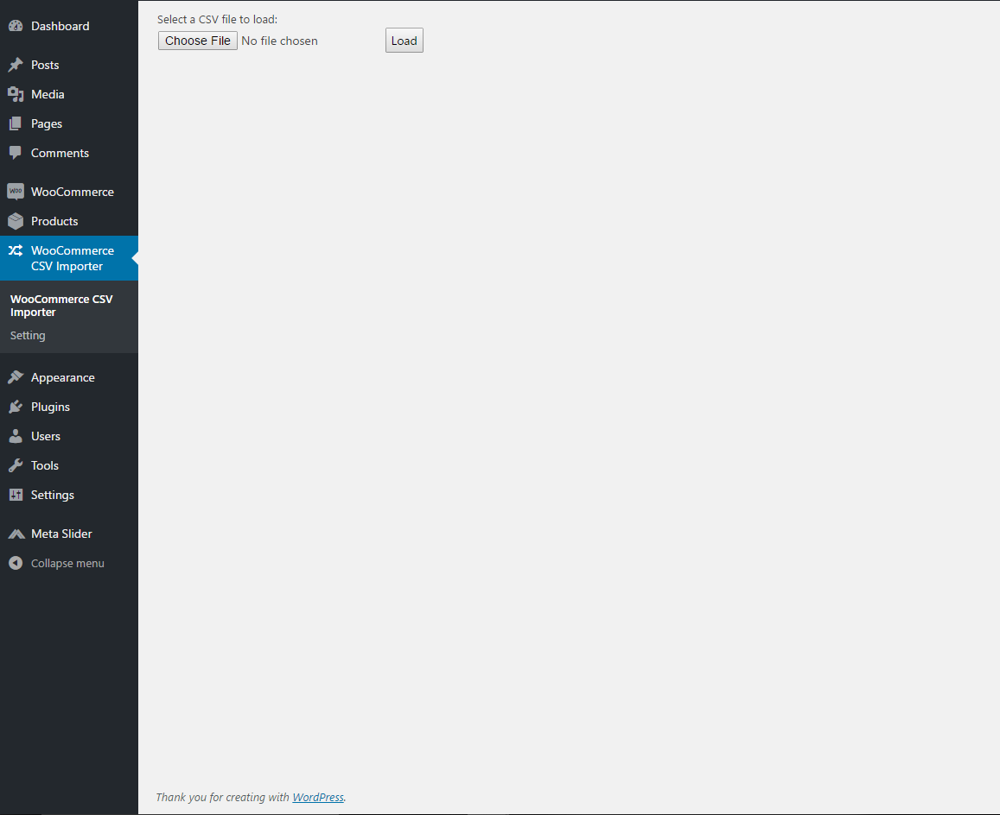
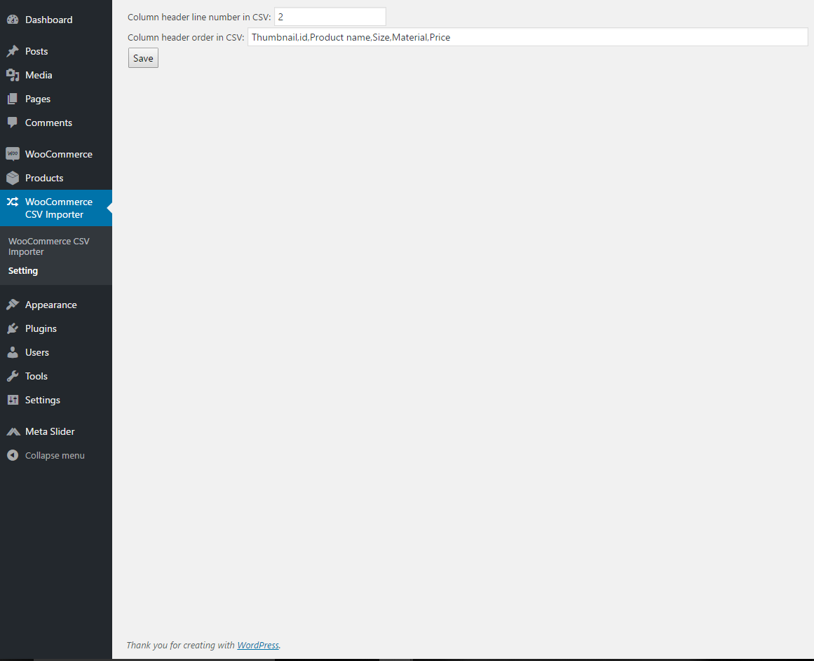
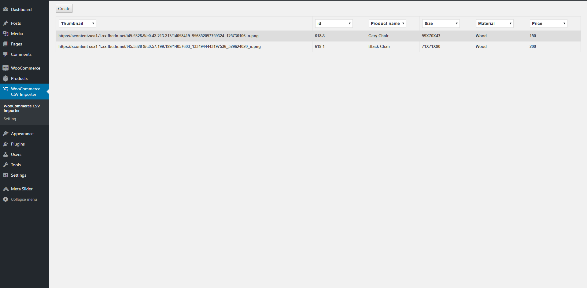

# wc-csv-importer
A WordPress plugin that allow user to add multiple products in WooCommerce with CSV file.

## Technologies Used
- [PHP](https://secure.php.net/manual/en/intro-whatis.php)
- [JavaScript](https://www.javascript.com/)
- [MySQL](https://www.mysql.com/)

## Screenshots
A place for user to load their CSV file.

A place for user to customized their column header in the order they want and the field they want. In addition, they may also set which line number for the column header in the CSV file.

After they loaded their CSV file, they may preview their CSV file beforehand. During the preview, they may also switch their column header around if needed. If they happen to need to create a brand new column, they may simply go to the setting to add a new field and it will show up in the dropdown.

Once they feel like they are done with the preview. They may simply click the Create button. Once it is completed. They may head over to WooCommerce to see all their newly created products from the CSV file.

## Disclaimer
Many of the code was derived and inspired from [WordPress Plugin Boilerplate](https://github.com/DevinVinson/WordPress-Plugin-Boilerplate) by [DevinVinson](https://github.com/DevinVinson).
